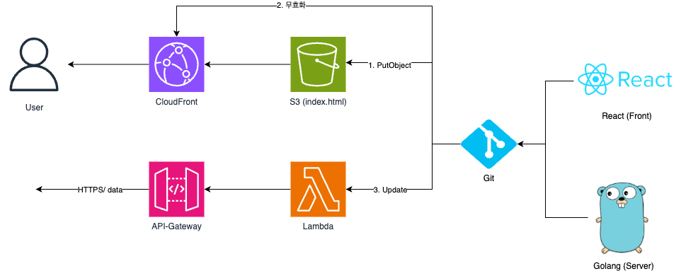
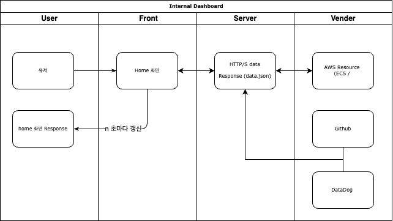

# DongStage

## Infra Architecture

## Flow Chart

## Requirements (Client : React, Server : Golang)

### Current

- Front 측에서 Server로 HTTP/S 호출
- 호출된 데이터를 Dashboard에 표시 (.json)
- n 초마다 Refresh (서버통신)
- 검색기능 존재
- vendor, resource 별로 이모지 존재 (이모지 추후 추가)

### TOBE

- 로그인, Guest 로그인
- HTTP URL 갱신
- RBAC 기능 추가 (권한별로 데이터 조회 및 access 가능)
- HTTP 통신 기능 추가
- 최근 로그 및 Monitoring 기능 추가 (시계열 데이터 - influxdb)
